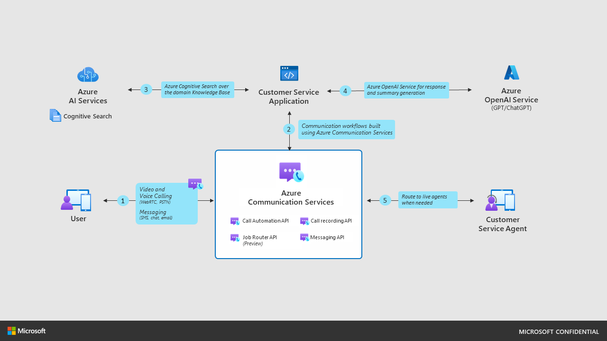
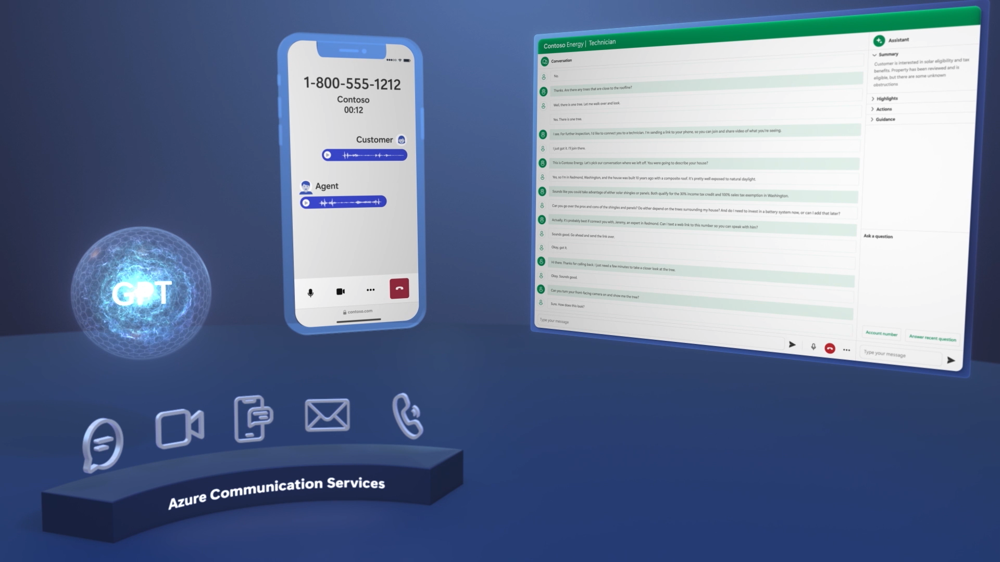
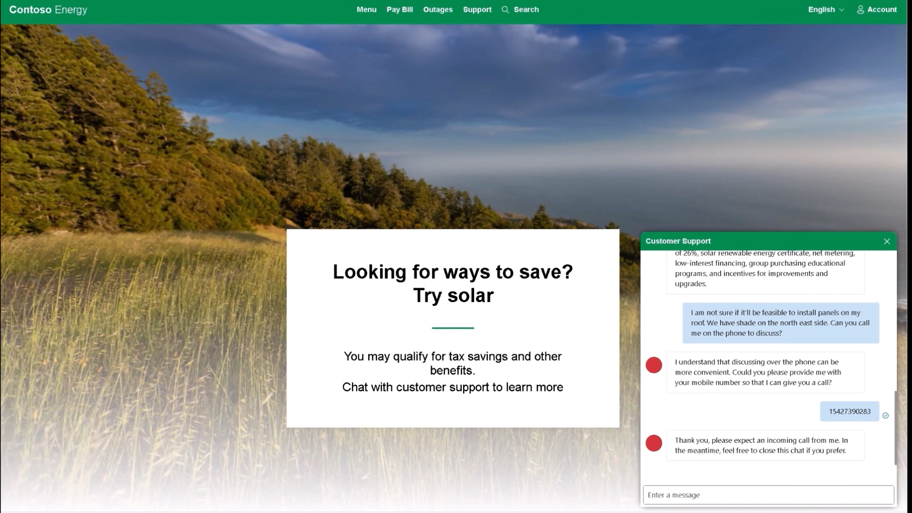
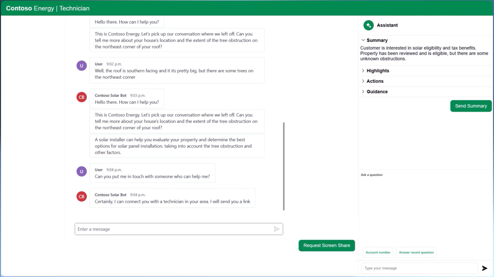

# Customer service sample application with Azure Communication Services and Azure OpenAI

In this code sample, you will learn how to combine Azure Communication Services with Azure OpenAI Service and Azure AI Services (previously known as Cognitive Services) to create an intelligent customer service solution. You will see how to create a natural language communication experience that can answer questions, initiate calls, and provide summaries using your company’s knowledge base and customer conversation data. You will use the Retrieval Augmented Generation pattern, which leverages Azure Cognitive Search to retrieve relevant information from your data sources and feed it to the GPT-35-turbo model, one of the large language models available in Azure OpenAI Service.

The code sample includes a web app that simulates a scenario where a customer interacts with a chatbot, a voice bot and an escalation path to a human technician from a fictitious company called Contoso Energy, which specializes in green energy and solar power. You will be able to run the app end to end by following the deployment instructions. We are excited for you to try it out and customize it to fit your own scenarios and data.



## Features
- A chat bot that can converse with customer in natural language using Contoso Energy’s knowledge base.
- A retrieval augmented generation (RAG) pattern that leverages Azure Cognitive Search to retrieve relevant information from data sources and feed it to Azure Open AI Service.
- A sample web app for the customer to interact with the chat bot.
- An escalation from chat conversation to a PSTN call initiated by the bot on customer’s request.
- A job router that assigns the job to the most suitable technician based on skills, availability, and location.
- Azure Communication Call Automation to convert voice to text and vice versa.
- An AI copilot that generates summaries, emails, and answers using the Azure OpenAI Service and Azure AI Service.



## Running the sample

### Cost Estimation
Pricing varies per region and usage, so it isn't possible to predict exact costs for your usage. However, you can try the Azure pricing calculator for the resources below.

- Azure OpenAI: Standard tier, ChatGPT and Ada models. Pricing per 1K tokens used, and at least 1K tokens are used per question. [Pricing](https://aka.ms/Mech-OpenAIpricing)
- Azure Cognitive Search: Standard tier, 1 replica, free level of semantic search. Pricing per hour. [Pricing](https://aka.ms/Mech-CogSearchpricing)
- Form Recognizer: SO (Standard) tier using pre-built layout. Pricing per document page, sample documents have 261 pages total. [Pricing](https://aka.ms/Mech-formpricing)
- Azure Blob Storage: Standard tier with ZRS (Zone-redundant storage). Pricing per storage and read operations. [Pricing](https://aka.ms/mech-blobpricing)
- Azure Communication Services : [Pricing](https://aka.ms/Mech-acspricing)
    - Email - Pay as you go tier
    - Calling, Recording and Video
    - Phone Number
    - Azure Communication Services Job Router: $0,01 per job created. First 100 jobs are free.

To reduce costs, you can switch to free SKUs for Azure Cognitive Search. There are some limits to consider; for example, you can have up to 1 free Cognitive Search resource per subscription, and the free Form Recognizer resource only analyzes the first 2 pages of each document. You can also reduce costs associated with the Form Recognizer by reducing the number of documents in the data folder, or by removing the post provision hook in azure.yaml that runs the prepdocs.py script. 

Azure Communication Services offer free [trial phone numbers](https://aka.ms/Mech-trialnumbers) for calling. The trial period is for 30 days. Note that the trial numbers does not support SMS.

### Pre-requisites
- An Azure account with an active subscription. For details, see [Create an account for free](https://aka.ms/Mech-Azureaccount) 
- For local run: Install Azure Dev Tunnels CLI. For details, see [Create and host dev tunnel](https://learn.microsoft.com/en-us/azure/developer/dev-tunnels/get-started?tabs=windows) 
- [.NET 7](https://dotnet.microsoft.com/download)
- Powershell 7+ (pwsh) - For Windows users only.
   * Important: Ensure you can run pwsh.exe from a PowerShell command. If this fails, you will likely need to upgrade PowerShell.
- Azure CLI

> **Note**<br> 
> In order to deploy and run this example, you'll need an **Azure subscription with access enabled for the Azure OpenAI service**. Request access [here](https://aka.ms/Mech-OpenAI). You can also visit [here](https://aka.ms/Mech-CogsSearch1) to get free Azure credits to get you started. 

## Deploying to Azure Cloud 

### Starting from scratch
Execute the following steps, if you don't have any pre-existing Azure services and want to start from a fresh deployment.

> **Note**<br>
> This application uses the `gpt-35-turbo` model. When choosing which region to deploy to, make sure they're available in that region (i.e. EastUS). For more information, see the [Azure OpenAI Service documentation](https://aka.ms/Mech-OpenAIdocs). 

- Clone the project to a new folder.
- Open a new powershell terminal and run `.\start.ps1` for Windows or `start.sh` (for Linux and Mac)
    <br />Enter the desired subscription, location and a short descriptive environment name.
- This command will:
   - Create the required Azure resources necessary to run the sample. 
   - Automatically include any of the PDF files in `data/` folder to Azure Search index as the knowledge base that is referred by the bot.
   - Build and deploy backend and frontend webapps necessary for hosting the sample webapp.
   - Register the backend application to receive notifications from Azure Communication Service events.
- After the application is deployed, you will see a URL for frontend in the console output. Click that URL to interact with the application in your browser.

Sample output:
```
You can view the resources created under the resource group <your rg name> in Azure Portal: https:/portal.azure.com/#@/...

Backend endpoint: https://app-app... 
Frontend endpoint: https://wapp-app-web-...
```
> **Note**<br >
> It may take several minutes for the application to get fully deployed. Go grab a cup of coffee or listen to your favourite song.

### Manual steps
Almost there! You need to do three simple steps manually in the [Azure portal](https://portal.azure.com)- 

- [Connect Azure AI service to Azure communication service resource](https://aka.ms/Mech-connectACSWithAI).
- Add a Calling and SMS enabled telephone number to your Communication resource. [Get a phone number](https://aka.ms/Mech-getPhone).
- [Set up the email service](https://aka.ms/Mech-EmailService). [Create a managed Azure email domain](https://aka.ms/Mech-emaildomain) that will be used for sending emails. 
- Update the backend App Service application settings
   - Open the web app resource created for backend application and navigate to the Environment variables blade.
   - Update values for `AcsPhoneNumber` and `EmailSender` with the phone number and sender email address obtained in previous steps.
   - Update the value for `EmailRecipient` with your email address where you would like to receive emails sent out by the sample applications.
   - Remember to save settings.
  
## Setup Instructions – Local environment  

#### 1. Setup and host your Azure DevTunnel
[Azure DevTunnels](https://learn.microsoft.com/en-us/azure/developer/dev-tunnels/overview) is an Azure service that enables you to share local web services hosted on the internet. Use the commands below to connect your local development environment to the public internet. This creates a tunnel with a persistent endpoint URL and which allows anonymous access. We will then use this endpoint to notify your application of chat and job router events from the Azure Communication Service.
```bash
devtunnel create --allow-anonymous
devtunnel port create -p 7108 --protocol https
devtunnel host
```
Make a note of the devtunnel URI. You will need it at later steps.

#### 2. Run the `start.ps1` or `start.sh` to provision your resources, if not done before.

#### 3. Update dev tunnel uri in `backend\app\appsettings.json` 

##  Running the backend application locally
- Ensure your Azure Dev tunnel URI is active and points to the correct port of your localhost application.
- Run `dotnet run` to build and run the sample application.
- Register an EventGrid Webhook for the `ChatMessageReceivedInThread`, `RouterWorkerOfferIssued`, `RouterWorkerOfferAccepted` and `CallEnded` events that points to your DevTunnel URI and route “/api/events”. Read more about Azure Event Grid webhooks [here](https://learn.microsoft.com/en-us/azure/event-grid/event-schema-communication-services).
- Navigate to https://locahost:7108/swagger to familiarize yourself with available API routes on the backend application.

## Running the frontend application locally
- Navigate to `app/frontend`
- Install dependencies

    ```bash
    npm install
    ```
- Start the frontend app
    ```bash
    npm run start
    ```
    This will open a client server on port 3000 that serves the website files. By default it will connect to the localhost backend server running on port 7108

## Application Flow
Click on "Customer Service" button to start conversing with the bot via chat.



Voip Call - The application will send a voip call join link to the phone number you share in the chat with the bot. However, if you do not have a verified Azure Communication Services phone number, your Telco may block the SMS as it includes a url. As a workaround, browse <url>/?callerType=Customer to get the join link. Replace url with the frontend url or the localhost url depending on if you are running locally or the deployed application. 

Agent View - The agent view includes chat history with the customer and AI assistant panel that can generate summary, action items and more. It gets active only after an agent gets involved in the flow. Browse <url>/?callerType=Agent to launch the agent view. 



## Resources
- [Azure Communication Services Blog](https://aka.ms/Mech-TechBlog) on AI infused customer service usecase
- [Microsoft Mechanics Youtube video showcasing this sample app](https://aka.ms/Mech-ytvideo)
- [Azure Communication Services](https://aka.ms/Mech-acsdocs)
- [Azure Cognitive Search](https://aka.ms/Mech-CogSearch)
- [Azure OpenAI Service](https://learn.microsoft.com/azure/cognitive-services/openai/overview)

> **Note**<br >
>The [Voice recognition with speech-to-text](https://aka.ms/Mech-SpeechToText) feature used in the demo is in public preview. This preview version is provided without a service-level agreement, and we don't recommend it for production workloads. Certain features might not be supported or might have constrained capabilities. For more information, see Supplemental Terms of Use for Microsoft Azure Previews.

>The PDF documents used in this demo contain information generated using a language model (Azure OpenAI Service). The information contained in these documents is only for demonstration purposes and does not reflect the opinions or beliefs of Microsoft. Microsoft makes no representations or warranties of any kind, express or implied, about the completeness, accuracy, reliability, suitability, or availability with respect to the information contained in this document. All rights reserved to Microsoft.
