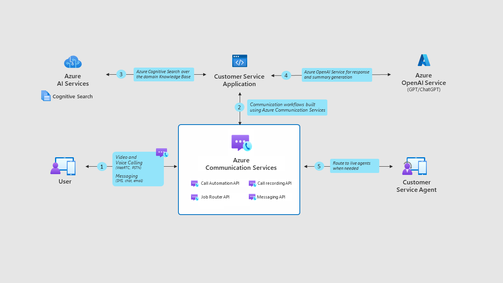

# Customer service sample application with Azure Communication Services and Azure OpenAI

In this code sample, you will learn how to combine Azure Communication Services with Azure OpenAI Service and Azure AI Services (previously known as Cognitive Services) to create an intelligent customer service solution. You will see how to create a natural language communication experience that can answer questions, initiate calls, and provide summaries using your company’s knowledge base and customer conversation data. You will use the Retrieval Augmented Generation pattern, which leverages Azure Cognitive Search to retrieve relevant information from your data sources and feed it to the GPT-35-turbo model, one of the large language models available in Azure OpenAI Service.

The code sample includes a sample web app that simulates a scenario where a customer interacts with a chatbot, a voice bot and an escalation path to human technician from a fictitious company called Contoso Energy, which specializes in green energy and solar power. You will be able to run the app end to end and customize it to fit your own scenario and data.



## Features
- A chat bot that can converse with customer in natural language using Contoso Energy’s knowledge base.
- A retrieval augmented generation (RAG) pattern that leverages Azure Cognitive Search to retrieve relevant information from data sources and feed it to Azure Open AI Service.
- A sample web app for the customer to interact with the chat bot.
- An escalation from chat conversation to a PSTN call initiated by the bot on customer’s request.
- A job router that assigns the job to the most suitable technician based on skills, availability, and location.
- Azure Communication Call Automation to convert voice to text and vice versa.
- An AI copilot that generates summaries, emails, and answers using the Azure OpenAI Service and Azure AI Service.
  


## Prerequisites
- Create an Azure account with an active subscription. For details, see [Create an account for free](https://azure.microsoft.com/free/)
- Create an Azure Communication Services resource. For details, see [Create an Azure Communication Resource](https://docs.microsoft.com/azure/communication-services/quickstarts/create-communication-resource). You'll need to record your resource **connection string** for this sample.
- A Calling and SMS enabled telephone number. [Get a phone number](https://learn.microsoft.com/en-us/azure/communication-services/quickstarts/telephony/get-phone-number?tabs=windows&pivots=platform-azp).
- Azure Dev Tunnels CLI. For details, see  [Enable dev tunnel](https://docs.tunnels.api.visualstudio.com/cli)
- Create an Azure Cognitive Services resource. For details, see [Create an Azure Cognitive Services Resource](https://learn.microsoft.com/en-us/azure/cognitive-services/cognitive-services-apis-create-account)
- An Azure OpenAI Resource and Deployment Model. See [instructions](https://learn.microsoft.com/en-us/azure/cognitive-services/openai/how-to/create-resource?pivots=web-portal).

## Setup Instructions – Local environment
Before running this sample, you'll need to setup the resources above with the following configuration updates:

##### 1. Setup and host your Azure DevTunnel
[Azure DevTunnels](https://learn.microsoft.com/en-us/azure/developer/dev-tunnels/overview) is an Azure service that enables you to share local web services hosted on the internet. Use the commands below to connect your local development environment to the public internet. This creates a tunnel with a persistent endpoint URL and which allows anonymous access. We will then use this endpoint to notify your application of chat and job router events from the Azure Communication Service.
```bash
devtunnel create --allow-anonymous
devtunnel port create -p 5165
devtunnel host
```
##### 2. Add a Managed Identity to the Azure Communication Resource that connects to the Cognitive Services resource
Follow the instructions in this [documentation](https://learn.microsoft.com/en-us/azure/communication-services/concepts/call-automation/azure-communication-services-azure-cognitive-services-integration).
##### 3. Add the required API Keys and endpoints
Open the appsettings.json file to configure the following settings:
    - `DevTunnelUri`: your dev tunnel endpoint
    - `AcsConnectionString`: Azure Communication Service resource's connection string.
    - `AcsConnectionEndpoint`: Azure Communication Service resource's endpoint.
    - `AzureOpenAIServiceKey`: Open AI's Service Key
    - `AzureOpenAIServiceEndpoint`: Open AI's Service Endpoint
    - `AzureOpenAIDeploymentModelName`: Open AI's Model name
    - `CognitiveServiceEndpoint`: The Cognitive Services endpoint
    - `CognitiveServiceKey`: The Cognitive Service Key


## Running the application
1. Azure DevTunnel: Ensure your AzureDevTunnel URI is active and points to the correct port of your localhost application
2. Run `dotnet run` to build and run the sample application
3. Register an EventGrid Webhook for the ChatMessageReceivedInThread event that points to your DevTunnel URI and route “/api/chat/incoming/events”. Read more about Azure Event Grid webhooks [here](https://learn.microsoft.com/en-us/azure/event-grid/event-schema-communication-services).

